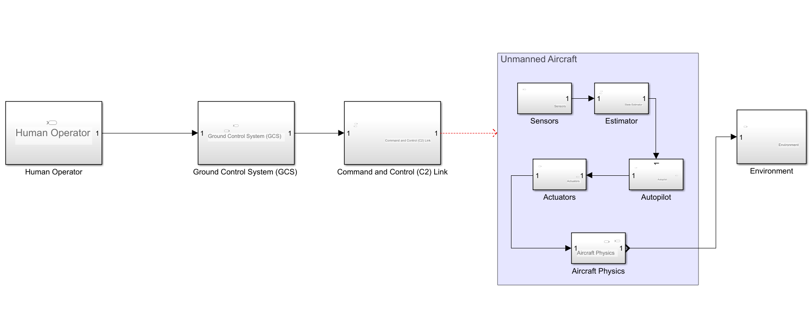

# Unmanned Aircraft System (UAS)

## Introduction

A UAS (Unmanned Aircraft System) is an integrated system of an unmanned aircraft, its onboard systems, the ground control station, payloads, and support elements required to safely operate the aircraft without an onboard pilot.

A UAS is not:
- just a drone
- just flight dynamics
- just an autopilot

It is an aviation system, comparable to a manned aircraft + cockpit + ATC + pilot.

## High-Level UAS Block Diagram (Mental Model)

## Breaking Down A UAS - Subsystem By System

### 1. Unmanned Aircraft (UA)

This is the physical flying vehicle.

It contains:
- Airframe
- Propulsion system
- Control surfaces
- Electrical power system
- Onboard avionics

The UA cannot fly safely on its own without the rest of the UAS.

### 2. Onboard Avionics (The Brain)

This is where most of the UAS intelligence lives.

Core Avionics Functions:
|Function|Purpose|
|--------|-------------|
|Sensing|Measure motion and enviroment|
|Estimation|Estimate true aircraft state|
|Control|Stabilize and command mode|
|Navigation|Know where it is|
|Autonomy|Decide what to do|

#### 2.1 Sensors (Perception Layer)
The aircraft does not know its state directly.

It measure:
- Accelerations (IMU)
- Angular rate (Gyros)
- Pressure
- GPS signals

These are: 
- Noisy
- Biased
- Delayed

**Raw sensor data is useless without estimation**

#### 2.2 State Estimation (The Most Crictical Block)

This answers:
    "What is my position, velocity, attitude,and health right now?"

Uses:
- INS mechanization
- GPS correction
- EKF/UKF

Without estimation:
- Control loops diverge
- Navigation fails
- Aircraft crashes

**This is the digital equivalent of a pilot's senses.**

### 3. Flight Control System (AutoPilot)

FCS provides low-level automation for stability and tracking. Implemented as nested PID loops on FPGAs/MCUs (e.g., STM32). Not "smart" - just reactive.

#### 3.1 Inner Loop (Stability Augmentation)

Fastest layer: Reflexive damping of disturbances (turbulence, asymmetry).

Details:
- Controls: Roll rate (p - aileron); pitch rate (q - elevator); yaw (r - rudder). Gains tuned via root locus.

- Loop Dynamics: Bandwidth 5 - 20 rad/s; phase margin > 45 $\degree$ for robustness
-Run Rate: 100-1000 Hz (e.g., 400 Hz in PX4) to outpace actuator delays (~20 ms);

#### 3.2 Outer Loop (Guidance Tracking)

Slower layer: Translates high-level commands to inner-loopn setpoints. 

Details:
- Controls: Altitude; Speed; Heading
- Wind Compensation: Sideslip $\beta = sin^{-1}$(wind component); crab angle for track hold.
- Run Rate: 10-50 Hz, as outer dynamics are slower (time constants 1-10 s).

### 4. Guidance & Navigation

- Path Planning and localiztaion. Runs on higher-level processors(e.g., companion computers like Raspberry Pi).

#### Guidance:
- Primitives: Straight legs, Dubins paths (minimum-turn circles), loiter (racetrack or orbit at 500m radius).

-Generators: A* for obstacle grids; RRT for dynamic environments.

- Metrics: Cross-track error < 10m; energy-optimal via Breguet range equation

#### Navigation:
- Outputs: NED frame (North-East-Down) position; ground vector; wind vector (from airspeed - groundspeed).

- Enhancements: Terrain following (DTED maps); VFR/IFR modes.

### 5. Actuators

Actuators convert electrical signals to  mechanical force. Non-ideal: Bandwidth limited (10 - 100 Hz), backlash (0.1-1 $\degree$), and saturation (e.g., $\pm 45 \degree$ deflection max)

#### Types

- Servos: PWM-driven (50 Hz, 1-2 ms pulse); torque 1 - 50 kg-cm (e.g, Hotec for control surfaces).

- Motors: BLDC with ESCs (Electronic Speed Controllers, 20-100A); KV rating(RPM/V) for prop matching.

- Exotics: Hydraulic for large UAS (e.g., actuators in MQ-9 Reaper).

